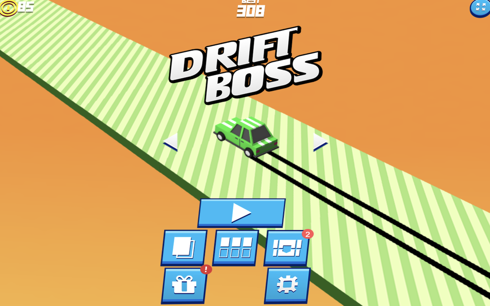

<div align="center">

# 🧩 Klotski Launcher

**Launch the classic puzzle game Klotski (华容道) with one click - Chrome Extension**

[](https://opensource.org/licenses/MIT)
[](https://github.com/CoderLim/klotski-chrome-extension)
[](https://chrome.google.com/webstore)

</div>

---

## ✨ Features

- 🧩 **One-Click Launch** - Quickly enter the Klotski puzzle game by clicking the extension icon
- 🖼️ **Beautiful Interface** - Game screenshots with gradient animated background
- ▶️ **Intuitive Control** - Central play button with smooth hover effects
- 🚀 **Quick Access** - Automatically opens [klotski.org](https://klotski.org) in a new tab
- 🎨 **Modern Design** - CSS3 animations and gradient effects
- 📦 **Lightweight** - Small bundle size, fast loading

## 📸 Preview

<div align="center">

</div>

*点击播放按钮开始华容道游戏*

## 🚀 Quick Start

### User Installation

#### Method 1: Install from Chrome Web Store (Recommended)
1. Visit [Chrome Web Store](#) (Coming soon)
2. Click "Add to Chrome"
3. Confirm installation permissions
4. Click the extension icon in the browser toolbar to use

#### Method 2: Manual Installation
1. Download the latest [release](https://github.com/CoderLim/klotski-chrome-extension/releases)
2. Unzip the `chrome-mv3-prod.zip` file
3. Open Chrome browser and visit `chrome://extensions/`
4. Enable "Developer mode" in the top right corner
5. Click "Load unpacked"
6. Select the unzipped folder
7. Done! Click the extension icon to start using

## 🛠️ Development Guide

### Prerequisites

- Node.js >= 16
- npm / pnpm / yarn

### Install Dependencies

```bash
# Using npm
npm install

# Using pnpm (Recommended)
pnpm install

# Using yarn
yarn install
```

### Development Mode

```bash
npm run dev
```

This will generate the development version in the `build/chrome-mv3-dev` directory.

**Load in Browser:**
1. Open Chrome browser
2. Visit `chrome://extensions/`
3. Enable "Developer mode" (toggle in top right)
4. Click "Load unpacked"
5. Select the `build/chrome-mv3-dev` folder in the project
6. The extension will automatically reload after code changes

### Build Production Version

```bash
npm run build
```

Built files will be in the `build/chrome-mv3-prod` directory.

### Package for Release

```bash
npm run package
```

This generates `build/chrome-mv3-prod.zip` which can be uploaded directly to Chrome Web Store.

## 🏗️ Tech Stack

| Technology | Description |
|------|------|
| ⚛️ **React 18** | Modern UI library |
| 📘 **TypeScript** | Type-safe JavaScript superset |
| 🧩 **Plasmo** | Powerful browser extension framework |
| 🎨 **CSS3** | Gradient animations and transitions |
| 🔧 **Chrome Extension API** | Manifest V3 |

## 📁 Project Structure

```
klotski-chrome-extension/
├── assets/                    # Asset files
│   ├── icon.png              # Extension icon
│   └── screenshots/          # Game screenshots
│       └── screenshot1.png
├── build/                     # Build output directory
│   ├── chrome-mv3-dev/       # Development build
│   └── chrome-mv3-prod/      # Production build
├── popup.tsx                  # Popup window main component
├── popup.css                  # Popup window styles
├── package.json              # Project config and dependencies
├── tsconfig.json             # TypeScript configuration
└── README.md                 # Project documentation
```

## 🎯 Core Features Explained

### Popup Window (popup.tsx)

- Uses React Hooks to manage hover state
- Calls `chrome.tabs.create` API to open klotski.org on play button click
- Responsive design with fixed 400x300px size

### Style Design (popup.css)

- **Gradient Background Animation**: 3-second looping gradient background effect
- **Hover Interaction**: Play button scales to 1.1x on hover
- **Shadow Effects**: Multi-layer shadows create depth
- **Semi-transparent Overlay**: Highlights the central play button

## 🤝 Contributing

Pull Requests and Issues are welcome!

1. Fork this repository
2. Create a feature branch (`git checkout -b feature/AmazingFeature`)
3. Commit your changes (`git commit -m 'Add some AmazingFeature'`)
4. Push to the branch (`git push origin feature/AmazingFeature`)
5. Open a Pull Request

### Development Guidelines

- Write code in TypeScript
- Follow ESLint rules
- Ensure code builds successfully before committing
- Add necessary comments and documentation

## 📝 Changelog

### v1.0.0 (2024-10-09)
- 🎉 Initial release
- ✨ Implemented basic popup window
- 🎨 Added game screenshots and play button
- 🚀 Integrated klotski.org quick launch

## 📄 License

This project is licensed under the [MIT](LICENSE) License.

## 🔗 Related Links

- [klotski.org](https://klotski.org) - Online puzzle game platform
- [Plasmo Framework](https://www.plasmo.com/) - Extension development framework
- [Chrome Extension Docs](https://developer.chrome.com/docs/extensions/)

## 💬 Feedback & Support

For questions or suggestions, feel free to:
- Submit an [Issue](https://github.com/CoderLim/klotski-chrome-extension/issues)
- Email: your.email@example.com

---

<div align="center">

**⭐ If this project helps you, please give it a Star! ⭐**

Made with ❤️ by [CoderLim](https://github.com/CoderLim)

</div>
